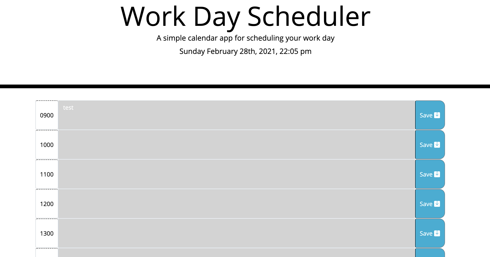

# hw5-work-scheduler

## Description

This application is intended to ease the stresses of daily life by providing a way to organize your day by timeblocks.  This is a good way to increase time management.  This is also a good project to practice my HTML, CSS, Javascript, and jQuery skills, as a new programmer it is important to apply these skills in a practical setting.

## Usage

This application is utilized by typing in your schedule details to the appropriate time blocks and saving by clicking the button.  This will keep track of your schedule even if the page is closed out, the information will still display until you replace it.  Depending on the time of day, if the time block is in the past it will color code it gray, if it is in the present it will color code it red, and if it is in the future it will color code it green.  There is a clock at the top displaying the local time and date for ease of use.

## Links

This is a link to the live site:[Live Site](https://madison-vega.github.io/hw5-work-scheduler/index.html)
This is a link to the repository:[Repo](https://github.com/madison-vega/hw5-work-scheduler)

### License

MIT License

Copyright (c) [2021] [MadisonVega]

Permission is hereby granted, free of charge, to any person obtaining a copy
of this software and associated documentation files (the "Software"), to deal
in the Software without restriction, including without limitation the rights
to use, copy, modify, merge, publish, distribute, sublicense, and/or sell
copies of the Software, and to permit persons to whom the Software is
furnished to do so, subject to the following conditions:

The above copyright notice and this permission notice shall be included in all
copies or substantial portions of the Software.

THE SOFTWARE IS PROVIDED "AS IS", WITHOUT WARRANTY OF ANY KIND, EXPRESS OR
IMPLIED, INCLUDING BUT NOT LIMITED TO THE WARRANTIES OF MERCHANTABILITY,
FITNESS FOR A PARTICULAR PURPOSE AND NONINFRINGEMENT. IN NO EVENT SHALL THE
AUTHORS OR COPYRIGHT HOLDERS BE LIABLE FOR ANY CLAIM, DAMAGES OR OTHER
LIABILITY, WHETHER IN AN ACTION OF CONTRACT, TORT OR OTHERWISE, ARISING FROM,
OUT OF OR IN CONNECTION WITH THE SOFTWARE OR THE USE OR OTHER DEALINGS IN THE
SOFTWARE.